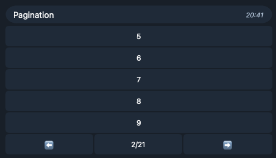

Сделаем клавиатуру с числами от 0 до 100.



```kotlin
val numbers = (0..100).toList()
```

## Объявление pager

Объявим `pager` с уникальным id. Он должен быть на одном уровне с `state<...>`.

```kotlin
val numbersPager = pager(id = "numbers") {
    ...
}
...
state<...> { ... }
```

## Построение InlineKeyboard

Передаваемая в `pager` функция строит `InlineKeyboard` для конкретной страницы по
`offset` (отступу от начала) и `limit` (максимальному количеству кнопок на странице).
В нашем случае, когда мы делим на страницы список, можно воспользоваться
функциями `drop` и `take`. Затем построим `InlineKeyboard` с элементами только из этой части списка.

```kotlin
val numbersPager = pager(id = "numbers") {
    val paginatedNumbers = numbers.drop(offset).take(limit)
    inlineKeyboard {
        paginatedNumbers.forEach { item ->
            row {
                dataButton(item.toString(), SampleQuery(item))
            }
        }
    }
}
```

## Переключение страниц

Теперь нужно как-то переключать страницы.
Для этого используется функция `navigationRow`, она
создаёт строку с кнопками назад, вперёд и счётчиком страниц.
Для работы ей требуется общее число элементов.

```kotlin
val numbersPager = pager(id = "numbers") {
    val paginatedNumbers = numbers.drop(offset).take(limit)
    inlineKeyboard {
        paginatedNumbers.forEach { item ->
            row {
                dataButton(item.toString(), SampleQuery(item))
            }
        }
        navigationRow(itemCount = numbers.size)
    }
}
```

## Отправка сообщения

Чтобы показать клавиатуру со страницами, отправим сообщение, используя `numbersPager.replyMarkup`

```kotlin
send(
    chat = message.chat,
    text = "Numbers",
    replyMarkup = numbersPager.replyMarkup
)
```

# Полный пример

```kotlin
@StateMachine(baseQueryKClass = Query::class)
val stateMachine = rolelessStateMachine<DialogState, UserId>(initialState = EmptyState) {
    val numbers = (0..100).toList()
    val numbersPager = pager(id = "numbers") {
        val paginatedNumbers = numbers.drop(offset).take(limit)
        inlineKeyboard {
            paginatedNumbers.forEach { item ->
                row {
                    dataButton(item.toString(), SampleQuery(item))
                }
            }
            navigationRow(itemCount = numbers.size)
        }
    }
    anyState {
        onCommand("pager", description = null) { message ->
            send(
                chat = message.chat,
                text = "Numbers",
                replyMarkup = numbersPager.replyMarkup
            )
        }
    }
}
```

[Полный код](https://github.com/ithersta/tgbotapi-fsm/tree/main/sample/src/main/kotlin/com/ithersta/tgbotapi/sample/pagination)
