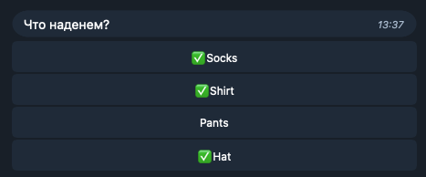

Сделаем бота со множественным выбором,
который спрашивает, что надеть.



Типичный гардероб:
```kotlin
@Serializable
enum class Clothes {
    Socks, Shirt, Pants, Hat
}
```

Что уже надели, будем хранить в состоянии:
```kotlin
@Serializable
data class MultipleChoiceState(
    val selectedClothes: Set<Clothes> = emptySet(),
) : DialogState
```

Теперь реализуем `onEnter` для нашего состояния.
Если одежда есть в списке выбранных, будем рисовать кнопку с галочкой,
иначе -- без.
```kotlin
state<MultipleChoiceState> {
    onEnter { chat ->
        val keyboard = inlineKeyboard {
            Clothes.values().forEach { clothes ->
                row {
                    if (clothes in state.snapshot.selectedClothes) {
                        dataButton("✅${clothes.name}", UnselectQuery(clothes))
                    } else {
                        dataButton(clothes.name, SelectQuery(clothes))
                    }
                }
            }
        }
        send(chat, text = "Что наденем?", replyMarkup = keyboard)
    }
}
```

Для обработки нажатий кнопок понадобится два типа запросов: выбрать и снять выбор.
[Подробнее о Data Callback Query](/docs/core/typesafe-data-callback-queries/).
```kotlin
@Serializable
sealed interface Query

@Serializable
@SerialName("s")
class SelectQuery(val clothes: Clothes) : Query

@Serializable
@SerialName("u")
class UnselectQuery(val clothes: Clothes) : Query
```

По нажатию кнопки с `SelectQuery` будем добавлять
одежду во множество выбранных.
```kotlin
onDataCallbackQuery(SelectQuery::class) { (data, query) ->
    state.override { copy(selectedClothes = selectedClothes + data.clothes) }
    answer(query)
}
```

А по нажатию кнопки с `UnselectQuery` -- убирать.
```kotlin
onDataCallbackQuery(UnselectQuery::class) { (data, query) ->
    state.override { copy(selectedClothes = selectedClothes - data.clothes) }
    answer(query)
}
```

На этом этапе уже всё работает, но бот присылает
новое сообщение при каждом нажатии. Чтобы это исправить,
запомним в состоянии id сообщения и впоследствии будем
его редактировать.

Обновлённый класс состояния:
```kotlin
@Serializable
data class MultipleChoiceState(
    val selectedClothes: Set<Clothes> = emptySet(),
    val messageId: MessageId? = null
) : DialogState
```

Обновлённый обработчик `onEnter` запоминает id сообщения
при первой отправке, а при последующих изменениях
состояния редактирует существующее сообщение.
```kotlin
onEnter { chat ->
    val keyboard = inlineKeyboard {
        Clothes.values().forEach { clothes ->
            row {
                if (clothes in state.snapshot.selectedClothes) {
                    dataButton("✅${clothes.name}", UnselectQuery(clothes))
                } else {
                    dataButton(clothes.name, SelectQuery(clothes))
                }
            }
        }
    }
    state.snapshot.messageId?.let { id ->
        runCatching {
            editMessageReplyMarkup(chat, id, keyboard)
        }
    } ?: run {
        val message = send(chat, text = "Что наденем?", replyMarkup = keyboard)
        state.overrideQuietly { copy(messageId = message.messageId) }
    }
}
```


Телеграм считает ошибкой ситуацию, когда метод
редактирования ничего не меняет (а такое может быть, если
быстро нажимать на кнопки), поэтому
`editMessageReplyMarkup` заключён в `runCatching`.


[Полный код](https://github.com/ithersta/tgbotapi-fsm/tree/main/sample/src/main/kotlin/com/ithersta/tgbotapi/sample/multiplechoice)
